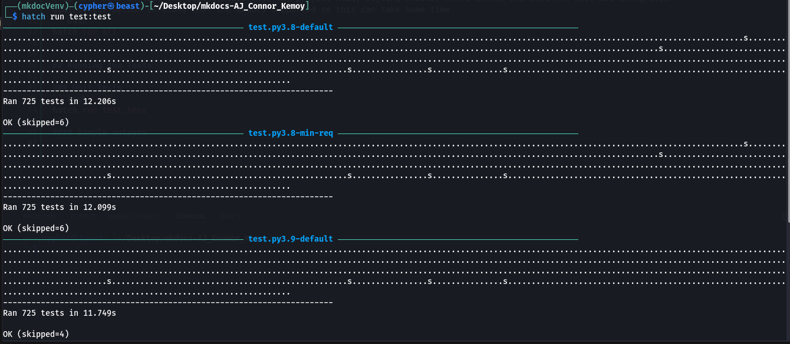

# How to Reproduce Test Results and Coverage

## Prerequisites

1.  Clone the project:

    ```bash
    git clone https://github.com/kemoycampbell/mkdocs-AJ_Connor_Kemoy
    ```

2.  Change directory into the project folder and create a virtual environment.  
    In this example, create a virtual environment called mkdocVenv:

    ```bash
    cd mkdocs-AJ_Connor_Kemoy && python3 -m venv mkdocVenv
    ```

3.  Activate the mkdocVenv environment.  
**The command depends on your operating system:**

    - Linux & MacOS

    ```bash
    source mkdocVenv/bin/activate
    ```

    - Windows

    ```bash
    source mkdocVenv/Scripts/activate
    ```

4.  Install Hatch (the main testing tool):

   ```bash
   pip install hatch
   ```

## Reproducing testResults

To get the same test results as in the `testResults` file, run:

```bash
hatch run test:test
```

This runs the unit tests across Python versions 3.8-3.12 and gives you the same output as `testResults`.

### Sample Output



### Expected Output

- **Total Tests**: 725 tests per Python version
- **Typical Results**: 719-721 passed, 4-6 skipped per version
- **Runtime**: ~10-18 seconds per Python version

### Capturing Output to File

To save the test output just like `testResults`:

```bash
hatch run test:test 2>&1 > testResults
```

### Integration Tests

Integration tests are also available. To run them:

```bash
hatch run integration:test
```

#### Sample Output


#### Observations

Like the unit tests, integration tests run across Python versions 3.8–3.12.
The integration tests include:

- Building installed themes
- Building theme: mkdocs
- Building theme: readthedocs
- Building test projects
- Building test project: complicated_config
- Building test project: unicode
- Building test project: subpages
- Building test project: minimal

Theme and integration builds are placed in a temporary directory:
/tmp/mkdocs_integration-<8 unique characters>

At the end of both unit and integration tests, you might see:

```bash
Skipped 2 incompatible environments:
test.pypy3-default -> cannot locate Python: pypy3
test.pypy3-min-req -> cannot locate Python: pypy3
```

## Reproducing testCoverage

The coverage data in `testCoverage` is sourced from CodeCov. To view similar coverage information:

1.  **View online coverage report**:
   Visit: <https://app.codecov.io/github/mkdocs/mkdocs/tree/master>

2.  **Alternative - Run complete test suite** (includes coverage):

   ```bash
   hatch run all
   ```

### Expected Coverage Metrics

- **Overall Coverage**: 90.31%
- **Total Lines**: 3,747
- **Lines Covered**: 3,384
- **Lines Missed**: 363

## Additional Test Commands

- **Integration tests**: `hatch run integration:test`
- **Complete test suite**: `hatch run all` (includes style, lint, unit, integration)
- **Style fixes**: `hatch run style:fix`

## Notes

- Tests run across Python versions 3.8-3.12
- Some tests may be skipped on certain platforms (PyPy)
- The project uses pytest as the underlying test framework
- Hatch manages virtual environments and dependencies automatically
