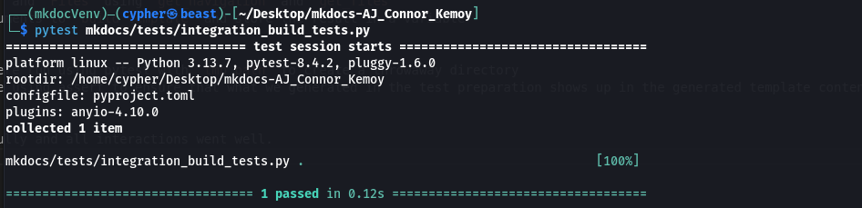

# Overview
This document highlighted some of the integration tests that were performed on the mkdocs

## Integration Test 1
### 1. Test Design Summary
**Modules tested**
- `build_template` function from `mkdocs.commands.build`
- `get_files` function from `mkdocs.structure.files`
- `get_navigation` function from `mkdocs.structure.nav`
- `load_config` function from `mkdocs.config`
- `MKDocConfig` class from `mkdocs.config`
- `Files` class from `mkdocs.structure.files`
- `Navigation` class from `mkdocs.structure.nav`

**Relevant snippet of code from mkdocs that lead to the integration testings**
```python
def _build_template(
    name: str, template: jinja2.Template, files: Files, config: MkDocsConfig, nav: Navigation
) -> str:
```

### 2. Test Data Preparation
- Utilize the tempfile to create a mkdocs project structure with `/docs`
- Create some sample navigations and test constants to use for testing and compare results
- Create mkdoc config with site name, site url and nav
- Load the config with `load_config`
- Create Jinja2 template content with site name and navigations
- Create the `Navigation` and `Files` using `get_navigation` and `get_files`
- pass the necessary arguments to `build_template` and store the result in a variable

### 3. Execution Results
- The integration test were run using pytest with `tmp_path` to create a throwaway directory
- The result were compare using assert to ensure that what we generated in the test preparation shows up in the generated template content.

**Observations:**
The test execute succesfully and all interactions went well.

**Sample output**



## Team Contributions

 Member | Task/Contribution | Notes  
--------|------------------|-------- 
 AJ Barea |  |
 Connor |  | 
 Kemoy | Wrote Integration test 1, write report documentation | Test the integration behavior for integration test #1, documents findings and execution setup
