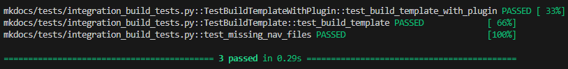

# Overview

This document highlighted some of the integration tests that were performed on the mkdocs

## Integration Test 1

### 1. Test Design Summary

#### Modules tested

- `_build_template` function from `mkdocs.commands.build`
- `get_files` function from `mkdocs.structure.files`
- `get_navigation` function from `mkdocs.structure.nav`
- `load_config` function from `mkdocs.config`
- `MKDocsConfig` class from `mkdocs.config`
- `Files` class from `mkdocs.structure.files`
- `Navigation` class from `mkdocs.structure.nav`

##### Relevant snippet of code from mkdocs that lead to the integration testings

```python
def _build_template(
    name: str, template: jinja2.Template, files: Files, config: MkDocsConfig, nav: Navigation
) -> str:
```

### 2. Test Data Preparation

- Utilize the tempfile to create a mkdocs project structure with `/docs`
- Create some sample navigations and test constants to use for testing and compare results
- Create mkdoc config with site name, site url and nav
- Load the config with `load_config`
- Create Jinja2 template content with site name and navigations
- Create the `Navigation` and `Files` using `get_navigation` and `get_files`
- pass the necessary arguments to `build_template` and store the result in a variable

### 3. Execution Results

- The integration test were run using pytest with `tmp_path` to create a throwaway directory
- The result were compare using assert to ensure that what we generated in the test preparation shows up in the generated template content.

**Observations:**
The test execute succesfully and all interactions went well.

**Sample output**  


## Integration Test 2

### 1. Test Design Summary

#### Modules tested

- `_build_template` function from `mkdocs.commands.build`
- `get_files` function from `mkdocs.structure.files`
- `get_navigation` function from `mkdocs.structure.nav`
- `load_config` function from `mkdocs.config`
- `MkDocsConfig` class from `mkdocs.config`
- `Plugins` class from `mkdocs.config.config_options`
- `Files` class from `mkdocs.structure.files`
- `Navigation` class from `mkdocs.structure.nav`

##### Relevant snippet of code from mkdocs that lead to the integration testings

```python
def _build_template(
    name: str, template: jinja2.Template, files: Files, config: MkDocsConfig, nav: Navigation
) -> str:

    # Some other code for _build_template...

    output = config.plugins.on_post_template(output, template_name=name, config=config) # this line was targeted for testing plugin integration in build template process

    return output
```

### 2. Test Data Preparation

- Create a dummy plugin that modifies the output of a rendered template in the `on_post_template` event
- Mock the entrypoints method from `importlib.metadata` that plugins calls to include our dummy plugin
- Utilize the tmp_path pytest fixture to create a mkdocs project structure with `/docs`
- Create a simple config file using the same fixture with a sitename, site url, nav, and a single plugin with two options
- load the config with `load_config`
- Create a Jinja2 template content with site name and navigations
- Create the `Navigation` and `Files` using `get_navigation` and `get_files`
- Pass the necessary arguments to `_build_template` and store the result in a variable

### 3. Execution Results

- The test was run using pytest with the `tmp_path` fixture to create a throwaway directory for the sample project and config file
- The results were compare using asserts to ensure that what we generated in the test preparation shows up and that the dummy plugin modified the output as expected.

**Observations:**
The dummy plugin successfully modified the output of the rendered template as expected, indicating that the plugin system which is loaded when a config object is created integrated well with config and the template rendering process. There were some initial troubles with how this test interacted with our first integration test due to both tests relying on the entrypoints method; however, this was resolved by ensuring that each test had the necessary data available to them.

## Integration Test 3

### 1. Test Design Summary

#### Modules tested

- `load_config` function from `mkdocs.config`
- `get_files` function from `mkdocs.structure.files`
- `get_navigation` function from `mkdocs.structure.nav`
- `Files` class from `mkdocs.structure.files`
- `Navigation` class from `mkdocs.structure.nav`

**Test Focus**: Edge case testing - navigation references non-existent files

This test validates the integration behavior when the configuration's navigation section references markdown files that don't exist in the docs directory. It tests how the config, files, and navigation modules handle this failure scenario.

### 2. Test Data Preparation

- Create temporary mkdocs project structure with `/docs` directory
- Create only `index.md` in docs directory
- Create config file with navigation referencing `index.md`, `about.md`, and `contact.md` (but only index.md exists)
- Load config using `load_config`
- Use `get_files` to scan the docs directory
- Use `get_navigation` to build navigation structure with incomplete files

### 3. Execution Results

- Test verifies that `get_files` correctly identifies only existing files (1 file found instead of 3)
- Test verifies that `get_navigation` handles missing files gracefully
- Navigation object created successfully but contains only pages for existing files
- Integration chain handles edge case without crashing

**Observations:**
The integration between config, files, and navigation modules properly handles the edge case of missing files referenced in navigation configuration.

**Sample output**  


## Team Contributions

 Member | Task/Contribution | Notes
--------|------------------|--------
 AJ Barea | Wrote Integration test 3, updated report documentation | Created edge case test for missing navigation files, tested integration behavior between config/files/navigation modules with incomplete data
 Connor | Wrote Integration test 2 and updated the report | Tested the behavior described by integration test #2 and documented my findings and execution setup. Resolved an issue caused by test #2 mocking entrypoints that affected test #1.
 Kemoy | Wrote Integration test 1, write report documentation | Test the integration behavior for integration test #1, documents findings and execution setup
