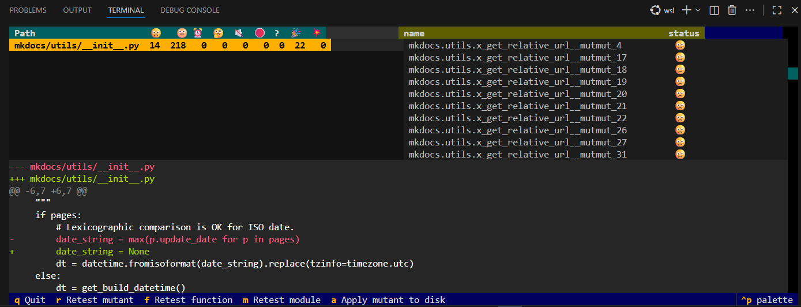

# Mutation Testing Report

This document reports on mutation testing performed on the MkDocs project using mutmut.

## Overview

**Target Module:** `mkdocs/utils/__init__.py`  
**Tool:** mutmut v3.3.1  
**Test Framework:** unittest  

> **Setup Instructions:** For detailed setup and execution instructions, see [`mutation-testing/README.md`](../courseProjectCode/mutation-testing/README.md)

---

## 📊 Mutation Testing Results

### Before: Initial Test Suite

**Baseline Run:**


```bash
Total Mutants: 254
Killed 🎉: 22 (8.7%)
No tests 🫥: 218 (85.8%)
Survived 🙁: 14 (5.5%)
Timeout ⏰: 0 (0%)
Suspicious 🤔: 0 (0%)

Mutation Score (tested code): 61.1% (22 of 36 tested mutants)
Speed: 13.65 mutations/second
```

**Analysis:** Only 36 mutants had test coverage (254 - 218 = 36). Of those tested, 14 survived, indicating gaps in test assertions.

### Mutmut Browser Analysis

Mutmut browser revealed that most of the Surviving mutants were related to mkdocs.utils.get_relative_url()


Targeted testing that was added to improve these mutation testing results can be found in [`mutation-testing/test_utils_mutations.py`](../courseProjectCode/mutation-testing/test_utils_mutations.py)

### After: Improved Test Suite

**After Adding Targeted Tests:**


```bash
Total Mutants: 254
Killed 🎉: 28 (11.0%)
No tests 🫥: 218 (85.8%)
Survived 🙁: 8 (3.1%)
Timeout ⏰: 0 (0%)
Suspicious 🤔: 0 (0%)

Mutation Score (tested code): 77.8% (28 of 36 tested mutants)
Speed: 13.49 mutations/second
```

**Improvement:** Added targeted tests killed 6 additional mutants, reducing survivors from 14 to 8.

### Comparison

 Metric | Before | After | Change
--------|--------|-------|--------
 Killed Mutants | 22 | 28 | +6 (+27.3%)
 Survived Mutants | 14 | 8 | -6 (-42.9%)
 Mutation Score (tested) | 61.1% | 77.8% | +16.7%
 Test Count | ~5 | ~9 | +4 tests

---

## Lessons Learned

**Key Takeaways:**

1.  **Code Coverage ≠ Test Quality**

      - Having tests that execute code doesn't mean they're effective at catching bugs
      - Mutation testing reveals weak assertions and missing edge cases

2.  **Mutation Testing Guides Improvement**

      - Survived mutants show exactly where tests are weak
      - Developing targeted test improvements is more effective than adding generic tests

3.  **Platform Requirements**

      - mutmut requires Unix fork support (WSL needed on Windows)
      - Setup is straightforward once mutmut environment requirements are met

4.  **Incremental Gains**

      - Adding 4 simple tests improved mutation score by 16.7%
      - Should focus on killing survivors rather than achieving 100% coverage moving forward

---

## Team Contributions

 Member | Task/Contribution | Notes  
--------|------------------  
 AJ Barea | Mutation testing setup, pyproject.toml configuration, test implementation, and documentation | Killed 6 mutants  
 Connor | - |
 Kemoy | - |

---

## References

- **Target Source File:** `mkdocs/utils/__init__.py`
- **Setup Guide:** [`courseProjectCode/mutation-testing/README.md`](../courseProjectCode/mutation-testing/README.md)
- **Mutmut GitHub:** <https://github.com/boxed/mutmut/>
- **Mutmut Documentation:** <https://mutmut.readthedocs.io/>
- **What is Mutation Testing?** <https://en.wikipedia.org/wiki/Mutation_testing>
- **Mutation Testing Best Practices** <https://medium.com/hackernoon/mutmut-a-python-mutation-testing-system-9b9639356c78>
