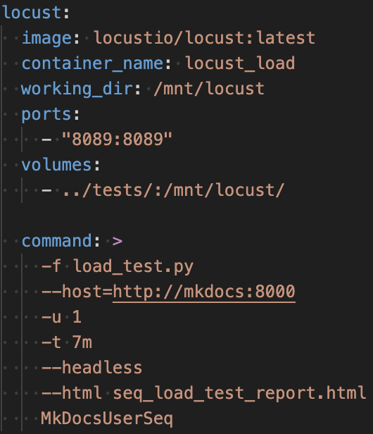
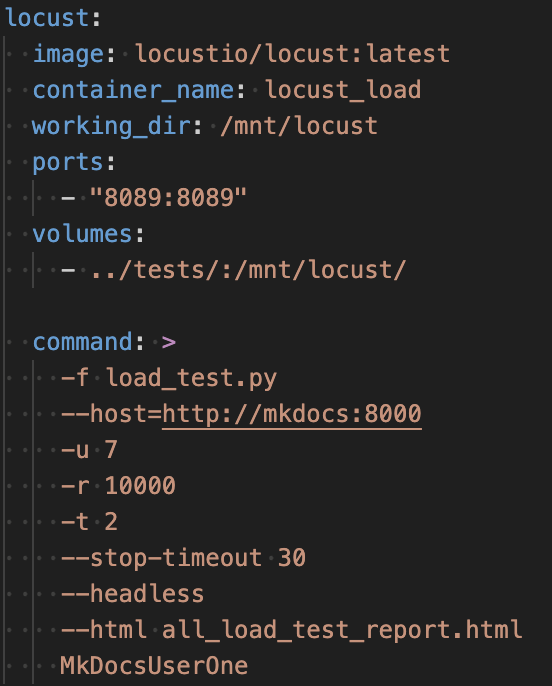
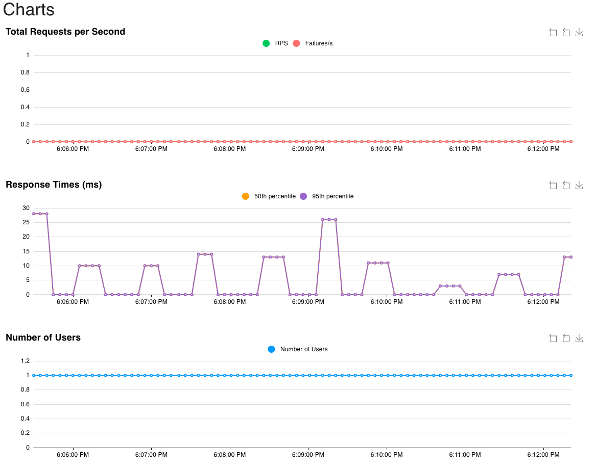
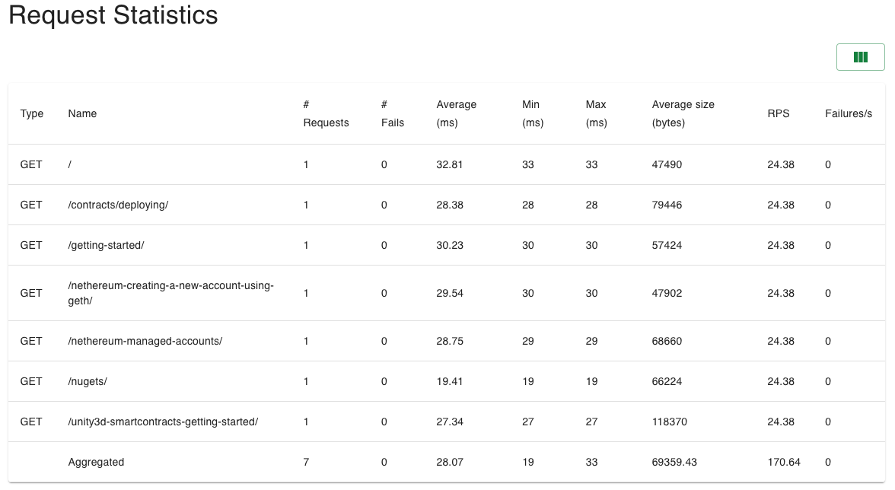
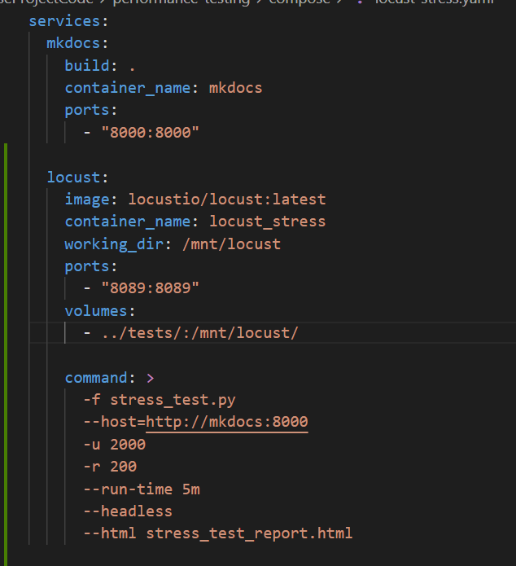
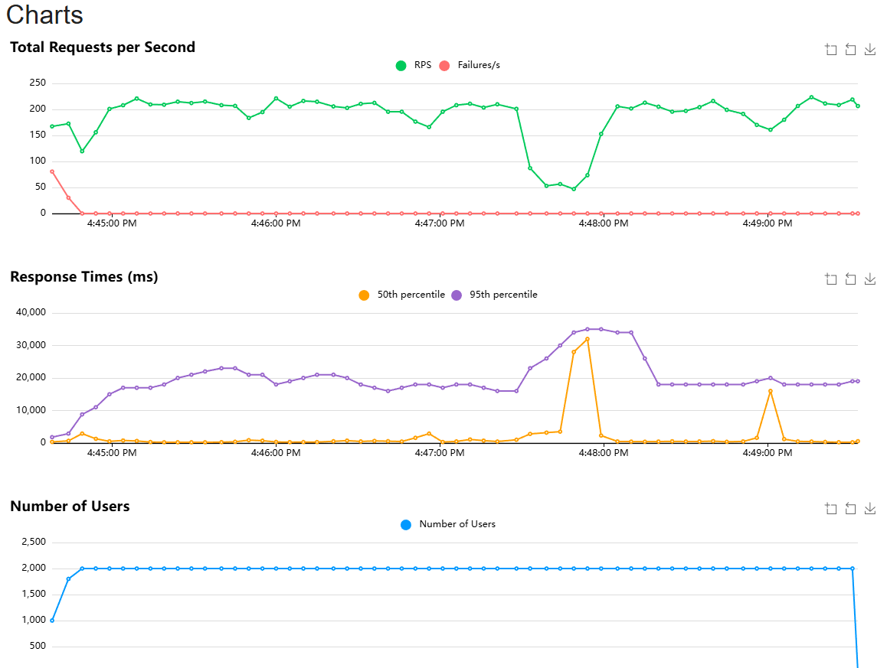
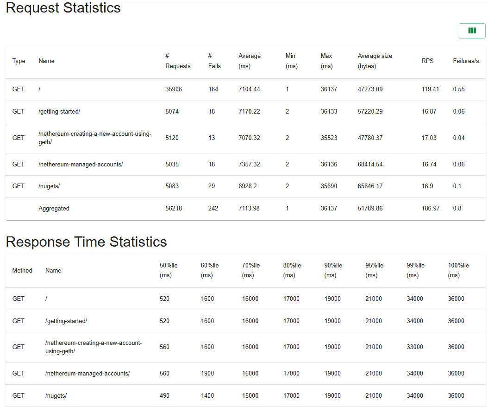

# Performance Testing

This document reports on performance testing performed on the MkDocs project.

## Load Tests
The load tests were designed to evaluate the performance of the MkDocs `serve` command under a normal load. Since the mkdocs serve is not intended for production use the normal number of users is very low since it normally runs locally. However, the user may look at multiple pages locally. Since there are two possible ways they could do this, two tests were run.
- **Sequential Page Load:** Each page is loaded one at a time by a single user. This test runs for 7 minutes to ensure that all pages are tested under a normal load pattern.
- **All Pages Loaded at Once:** All the pages are loaded simultaneously. This test runs for 1 minute since it loads all pages at once and the development server is single threaded.

| Attribute | Value |
|-----------|-------|
| **Component Tested** | `mkdocs serve` HTTP server |
| **Tools Used** | [Locust](https://docs.locust.io/en/stable/quickstart.html)  and [Docker Compose container](../../courseProjectCode/performance-testing/compose/locust-load.yaml)|
| **Endpoints Tested** | `/` , `/getting-started/`, `/nugets/`, `/nethereum-managed-accounts/`, `/nethereum-creating-a-new-account-using-geth/`, `/contracts/deploying/`, `/unity3d-smartcontracts-getting-started/` |
| **Test Type** | Load Test |

### 2. Configuration
#### Sequential Page Loads
| Parameter | Value |
|-----------|-------|
| **Users** | 1 |
| **Task Rate** | 1/min - 2/min |
| **Duration** | 7 minutes |

#### All Pages Loaded at Once
| Parameter | Value |
|-----------|-------|
| **Users** | 7 |
| **Spawn Rate** | 10,000/sec or 1/sec |
| **Max Duration** | ~32 seconds |

### 3. Results
#### Sequential Page Loads

[Sequential Load Test Locust HTML Report](../../courseProjectCode/performance-testing/seq_load_test.html)

#### All Pages Loaded at Once

[All Pages Loaded at Once Locust HTML Report](../../courseProjectCode/performance-testing/all_load_test.html)

### 4. Performance Finding
**Note:** The MkDocs development server is not intended for production use and is single-threaded. Performance measurements depend on the host machine's hardware and network conditions. This testing was conducted on a machine with 16 GB of RAM, and a 10th Gen Intel(R) Core(TM) i7-1068NG7 CPU @ 2.30GHz with 4 cores. Results may vary on different hardware.
#### Sequential Page Loads
**Finding:** The development server performance is stable under low (normal) load with low response times averaging 13.49 ms and 0% failures. Response times do vary depending on the page being loaded, with larger pages taking longer to load in most cases, but remain low overall.

#### All Pages Loaded at Once
**Finding:** Serve performance is stable under low (normal) load with low response times averaging 28.07 ms and 0% failures. Response times vary depending on the page being loaded but remain low overall. The average reponse time is slightly higher than the sequential load test.

## Stress Test
### 1. Test Scope and Design
| Attribute | Value |
|-----------|-------|
| **Component Tested** | `mkdocs serve` HTTP server |
| **Tools Used** | [Locust](https://docs.locust.io/en/stable/quickstart.html)  and [Docker Compose container](../../courseProjectCode/performance-testing/compose/locust-stress.yaml)|
| **Endpoints Tested** | `/` , `/getting-started/`, `/nugets/`, `/nethereum-managed-accounts/`, `/nethereum-creating-a-new-account-using-geth/`, `/contracts/deploying/`, `/unity3d-smartcontracts-getting-started/` |
| **Test Type** | Stress Test |

### 2. Configuration
| Parameter | Value |
|-----------|-------|
| **Max Users** | 2000 |
| **Spawn Rate** | 200/sec |
| **Duration** | 5 minutes |

### 3. Results

[Full Locust HTML Report](../../courseProjectCode/performance-testing/stress-test.html)

### 4. Performance Finding
**Finding:** Serve performance degraded as concurrent users increase with response times increased significantly and failures  occurred.

- **Observation:** As users increased to around 2,000 concurrent users, it begans to choke and take around 15-36 seconds to serve the requests. Based on the test results, the server can handle 200-220 req/sec before it becomes saturated and response times increase significantly with failures occurring. The number of failures remains low relatively to the total requests made.

- **Throughput:** The RPS remains between 165-220 RPS and this is expected due to serve not designed
production use and utilize a single process.

- **Things to keep in mind:**
  - MkDocs serve is not intended for production use and is single-threaded.
  - The perfomance measurements here depends on the host machine's hardware and network conditions.
  This was tested on a machine that contains 64 GB of RAM with NVIDIA GeForce RTX 3080 GPU and 12th Gen Intel(R) Core(TM) i9-12900K CPU @ 3.20GHz with 16 cores. So the result may vary on different hardware.

## Spike Test

### 1. Test Scope and Design

| Attribute | Value |
|-----------|-------|
| **Component Tested** | `mkdocs serve` HTTP server |
| **Tools Used** | [Locust](https://docs.locust.io/en/stable/quickstart.html) and [Docker Compose container](../../courseProjectCode/performance-testing/compose/locust-spike.yaml) |
| **Endpoint Tested** | `/` (Homepage) |
| **Test Type** | Spike Test |

### 2. Configuration

| Parameter | Value |
|-----------|-------|
| **Baseline Users** | 25 |
| **Spike Users** | 125 |
| **Spawn Rate** | 125/sec (instant spike) |
| **Pattern** | Baseline → Spike → Recovery |

### 3. Results

[Full Locust HTML Report](../../courseProjectCode/performance-testing/spike-test.html)

### 4. Performance Finding

**Finding:** Response time increased during spike but server remained stable with 0% failures.

- **Observation:** During the spike from 25 to 125 users, the 95th percentile response time increased from ~5ms to ~85ms
- **Throughput:** RPS increased from ~20 to ~80 requests/second during peak load
- **Recovery:** Server recovered immediately when load decreased, response times returned to baseline

## Team Contributions

 Member | Task/Contribution | Notes
--------|------------------|--------
 AJ Barea | Spike Test | Designed and executed Homepage spike test using Locust
 Connor | Created initial branch and files, two load tests | Designed and executed two load tests using Locust. One for loading pages sequentially and one for loading all pages at once
 Kemoy |Stress test, create docker containers, update the document | Designed and executed stress test using Locust, created Docker containers for testing environment & automation in headless modes