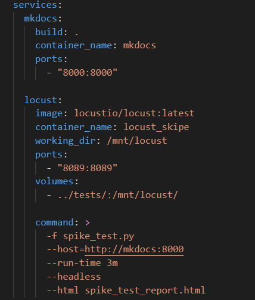
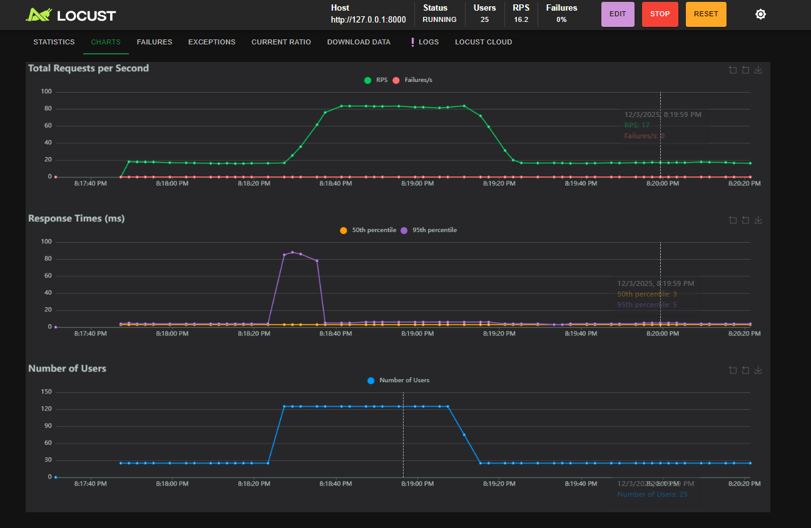

# Performance Testing

This document reports on performance testing performed on the MkDocs project.

## Load Test

## Stress Test

## Spike Test

### 1. Test Scope and Design

| Attribute | Value |
|-----------|-------|
| **Component Tested** | `mkdocs serve` HTTP server |
| **Tool Used** | [Locust](https://docs.locust.io/en/stable/quickstart.html) |
| **Endpoint Tested** | `/` (Homepage) |
| **Test Type** | Spike Test |

### 2. Configuration

| Parameter | Value |
|-----------|-------|
| **Baseline Users** | 25 |
| **Spike Users** | 125 |
| **Spawn Rate** | 125/sec (instant spike) |
| **Pattern** | Baseline → Spike → Recovery |

### 3. Results

[Full Locust HTML Report](../../courseProjectCode/performance-testing/spike-test.html)

### 4. Performance Finding

**Finding:** Response time increased during spike but server remained stable with 0% failures.

- **Observation:** During the spike from 25 to 125 users, the 95th percentile response time increased from ~5ms to ~85ms
- **Throughput:** RPS increased from ~20 to ~80 requests/second during peak load
- **Recovery:** Server recovered immediately when load decreased, response times returned to baseline

## Team Contributions

 Member | Task/Contribution | Notes
--------|------------------|--------
 AJ Barea | Spike Test | Designed and executed Homepage spike test using Locust
 Connor | | 
 Kemoy | | 