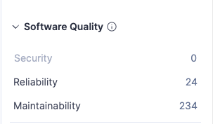
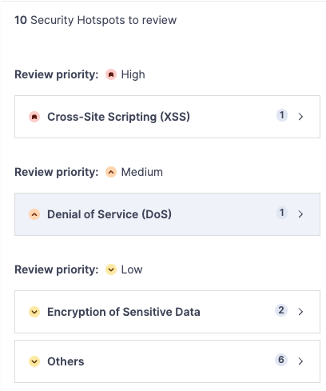

# Security Testing

This document reports on security testing performed on the MkDocs project using SonarQube.

## Tools
- **SonarQube Community Edition** – Static code analysis platform  
- **PostgreSQL** – Database backend for SonarQube  
- **SonarScanner** – CLI tool to analyze your project’s source code  
- **Docker** – Containerized environment for consistent setup  

**System Configuration**

Similar to the static analysis setup, this report uses **Docker Compose** to:

- Deploy SonarQube and PostgreSQL containers
- Automatically initialize SonarQube and generate an authentication token
- Append the token to the `.env` file for later use by the scanner

## 🔧 Workflow

1.  **Setting up the .env file**

    ```bash
    cp .env.example .env 
    ```

2.  **Configuring the permission**

    ```bash
    sudo chown -R 1000:1000 .
    ```

3.  **Run the docker compose to configure the tools**
    *quirk: If you are running this for the first time, you will need to run it twice as the first run generate the sonar token*

    ```bash
    docker compose up -d
    ```

4.  **View SonarQube Results**

    ```bash
    visit http://localhost:9888 in the browser
    login with your creds from .env
    ```

## 📊 Initial Scan Results
SonarQube performed an initial security scan of the MkDocs project. Below are the summarized results. Covering all of the source code files. Only files in the `tests` and `pycache` directories and markdown files were excluded from the scan.

### Issues Overview



**Software Quality:**

- 🔒 Security: 0
- ⚙️ Reliability: 24
- 🔧 Maintainability: 234

The initial scan by SonarQube did not identify any security issues in the MkDocs project. However, it did identify some security hotspots where potential issues could arise.

### Security Hotspots



There were 10 security hotspots identified for review.

**10 Security Hotspots to Review:**

- 🔴 High Priority: Cross-Site Scripting (XSS) - 1
- 🟠 Medium Priority: Denial of Service (DoS) - 1
- 🟡 Low Priority: Encryption of Sensitive Data - 2
- Others - 6

## Vulnerability Summary

### Vulnerability 1 - Creating a Jinja Environment with autoescape disabled
- **File:** `mkdocs/theme.py`
- **Line:** 162
- **Type:** Cross Site Scripting (XSS)
- **Severity:** High-ish (See Recommended Fix below)

**Recommended Fix:**

Since mkdocs is a static site generator, this may not be applicable since the end users are not directly interacting with the generated HTML in a dynamic way. The only way this could be exploited is if a user were to input malicious content into their markdown files or download a theme that inserts malicious content that would then be rendered as HTML. In this case, it is recommended to sanitize user inputs before rendering them by enabling autoescaping in the Jinja environment.

```python
# Original Code
env = jinja2.Environment(loader=loader, auto_reload=False)

# Recommended Fix (potentially safer)
env = jinja2.Environment(loader=loader, autoescape=True, auto_reload=False)
```

### Vulnerability 2 - 
- **File:** 
- **Line:** 
- **Type:** 
- **Severity:** 

**Recommended Fix:**

Recommended fix details go here.

```python
# Original Code

# Recommended Fix

```

### Vulnerability 3 - 
- **File:** 
- **Line:** 
- **Type:** 
- **Severity:** 

**Recommended Fix:**

Recommended fix details go here.

```python
# Original Code

# Recommended Fix

```

## Team Contributions

 Member | Task/Contribution | Notes  
--------|------------------|--------
 AJ Barea | | 
 Connor | Created initial version of report, README, and added one potential vulnerability. | Was able to reuse SonarQube setup from static analysis report. Another suggested tool would be HCL CodeSweep Extension for VS Code for local scanning of code. It identifies some other potential security issues, but has some overlap with SonarQube.
 Kemoy | | 
