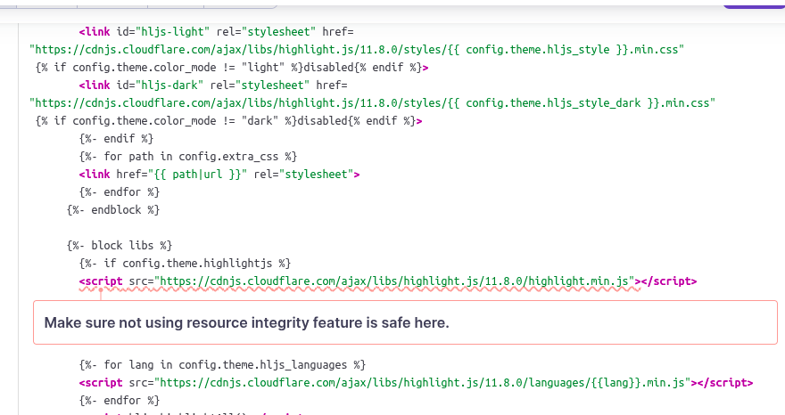
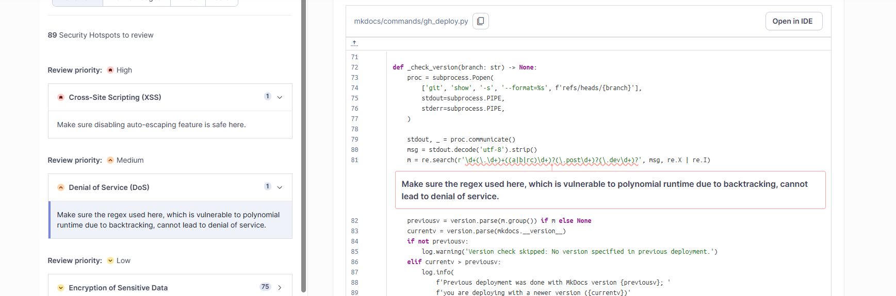

# Security Testing

This document reports on security testing performed on the MkDocs project using SonarQube.

## Tools
- **SonarQube Community Edition** – Static code analysis platform  
- **PostgreSQL** – Database backend for SonarQube  
- **SonarScanner** – CLI tool to analyze your project’s source code  
- **Docker** – Containerized environment for consistent setup  

**System Configuration**

Similar to the static analysis setup, this report uses **Docker Compose** to:

- Deploy SonarQube and PostgreSQL containers
- Automatically initialize SonarQube and generate an authentication token
- Append the token to the `.env` file for later use by the scanner

## 🔧 Workflow

1.  **Setting up the .env file**

    ```bash
    cp .env.example .env 
    ```

2.  **Configuring the permission**

    ```bash
    sudo chown -R 1000:1000 .
    ```

3.  **Run the docker compose to configure the tools**
    *quirk: If you are running this for the first time, you will need to run it twice as the first run generate the sonar token*

    ```bash
    docker compose up -d
    ```

4.  **View SonarQube Results**

    ```bash
    visit http://localhost:9888 in the browser
    login with your creds from .env
    ```

## 📊 Initial Scan Results
SonarQube performed an initial security scan of the MkDocs project. Below are the summarized results. Covering all of the source code files. Only files in the `tests` and `pycache` directories and markdown files were excluded from the scan.

### Issues Overview


**Software Quality:**

- 🔒 Security: 0
- ⚙️ Reliability: 24
- 🔧 Maintainability: 234

The initial scan by SonarQube did not identify any security issues in the MkDocs project. However, it did identify some security hotspots where potential issues could arise.

### Security Hotspots


There were 10 security hotspots identified for review.

**10 Security Hotspots to Review:**

- 🔴 High Priority: Cross-Site Scripting (XSS) - 1
- 🟠 Medium Priority: Denial of Service (DoS) - 1
- 🟡 Low Priority: Encryption of Sensitive Data - 2
- Others - 6

## Vulnerability Summary

### Vulnerability 1 - Creating a Jinja Environment with autoescape disabled
- **File:** `mkdocs/theme.py`
- **Line:** 162
- **Type:** Cross Site Scripting (XSS)
- **Severity:** High-ish (See Recommended Fix below)

**Recommended Fix:**

Since mkdocs is a static site generator, this may not be applicable since the end users are not directly interacting with the generated HTML in a dynamic way. The only way this could be exploited is if a user were to input malicious content into their markdown files or download a theme that inserts malicious content that would then be rendered as HTML. In this case, it is recommended to sanitize user inputs before rendering them by enabling autoescaping in the Jinja environment.

```python
# Original Code
env = jinja2.Environment(loader=loader, auto_reload=False)

# Recommended Fix (potentially safer)
env = jinja2.Environment(loader=loader, autoescape=True, auto_reload=False)
```

### Vulnerability 2 - Missing Resource Integrity Checks
- **File:** `mkdocs/themes/mkdocs/base.html`
- **Line:** 27,28,37,39,47
- **Type:**  Others
- **Severity:** Low

**About the vulnerablity**

Lines 27, 28, 37, 39, and 47 load JavaScript resources from third-party CDNs (Cloudflare and Google). Because these external scripts are included  without Subresource Integrity(SRI) checks, they expose the site to potential third-party supply-chain attacks.
If an attacker were to compromise the CDN or tamper with the hosted JavaScript files referenced in `mkdocs/themes/mkdocs/base.html`, every MkDocs-generated site using these resources could silently load malicious code.

Lack of SRI is listed on CWE as a weakness: [CWE-353](https://cwe.mitre.org/data/definitions/353.html) In additional, in 2021 OWASP places this in their top 10 and under a new category group "Software and Data Integrity Failures": [A08:2021 – Software and Data Integrity Failures(https://owasp.org/Top10/A08_2021-Software_and_Data_Integrity_Failures/




**Recommended Fix:**

Add Subresource Integrity (SRI) attributes to all external script tags. Generate integrity hashes using tools like [SRI Hash Generator](https://www.srihash.org/) and add both `integrity` and `crossorigin` attributes to CDN-loaded scripts.

```html
<!-- Original Code -->
<script src="https://cdnjs.cloudflare.com/ajax/libs/highlight.js/11.8.0/highlight.min.js"></script>

<!-- Recommended Fix -->
<script src="https://cdnjs.cloudflare.com/ajax/libs/highlight.js/11.8.0/highlight.min.js"
        integrity="sha384-[hash-value-here]"
        crossorigin="anonymous"></script>
```

### Vulnerability 3 - Regular Expression Denial of Service (ReDoS) in Version Parsing



- **File:** `mkdocs/commands/gh_deploy.py`
- **Line:** 81
- **Type:** Denial of Service (DoS) - Regular Expression Denial of Service (ReDoS)
- **Severity:** Medium

**Recommended Fix:**

The regex pattern contains nested quantifiers `\d+(\.\d+)+` which can cause catastrophic backtracking when processing malicious input. For example, a string like "1.1.1.1.1.1.1.1.1.1.1!" (many version-like segments without a final match) could cause the regex engine to try exponentially many match combinations, leading to significant CPU consumption and potential denial of service.

To fix this, either:
1. Simplify the regex to avoid nested quantifiers
2. Use a non-backtracking approach (e.g., manual parsing)
3. Add input length limits before regex matching

```python
# Original Code
m = re.search(r'\d+(\.\d+)+((a|b|rc)\d+)?(\.post\d+)?(\.dev\d+)?', msg, re.X | re.I)

# Recommended Fix - Option 1: Simplified regex with possessive quantifier alternative
# Use a more specific pattern that doesn't backtrack as much
m = re.search(r'\d+(?:\.\d+){1,3}(?:(?:a|b|rc)\d+)?(?:\.post\d+)?(?:\.dev\d+)?', msg, re.X | re.I)

# Recommended Fix - Option 2: Add input length validation
if len(msg) < 1000:  # Reasonable limit for version string
    m = re.search(r'\d+(\.\d+)+((a|b|rc)\d+)?(\.post\d+)?(\.dev\d+)?', msg, re.X | re.I)
else:
    m = None
```

## Team Contributions

 Member | Task/Contribution | Notes
--------|------------------|--------
 AJ Barea | Identified and documented ReDoS vulnerability in version parsing (gh_deploy.py:82) | Regular Expression Denial of Service vulnerability due to nested quantifiers causing catastrophic backtracking.
 Connor | Created initial version of report, README, and added one potential vulnerability. | Was able to reuse SonarQube setup from static analysis report. Another suggested tool would be HCL CodeSweep Extension for VS Code for local scanning of code. It identifies some other potential security issues, but has some overlap with SonarQube.
 Kemoy | Identified and documented Missing Resource Integrity Checks vulnerability (base.html) | CDN scripts loaded without SRI checks expose sites to supply-chain attacks. 
