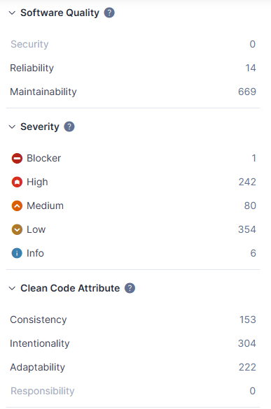
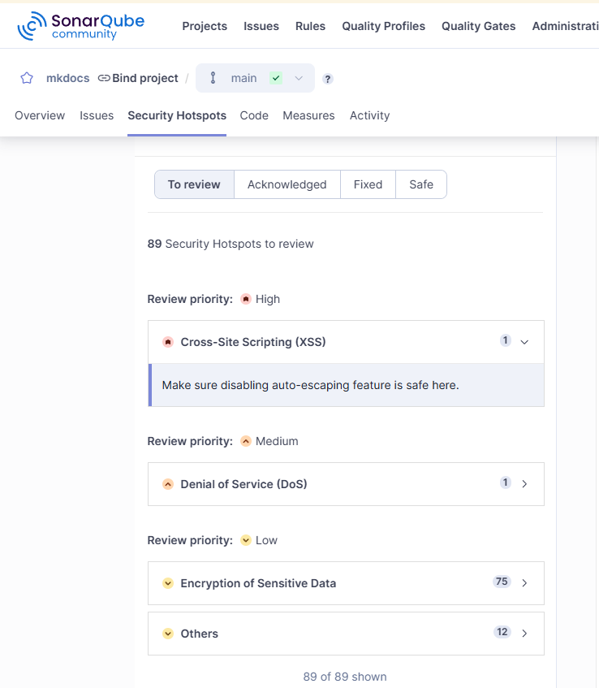
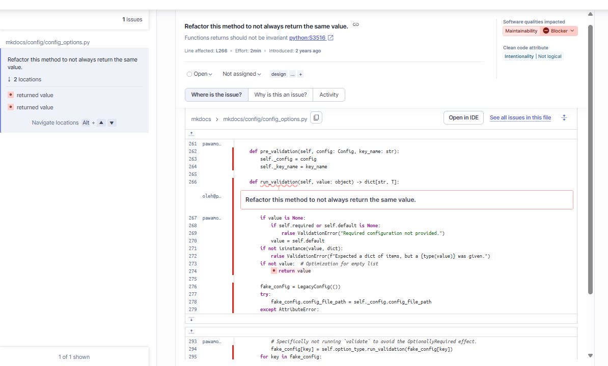
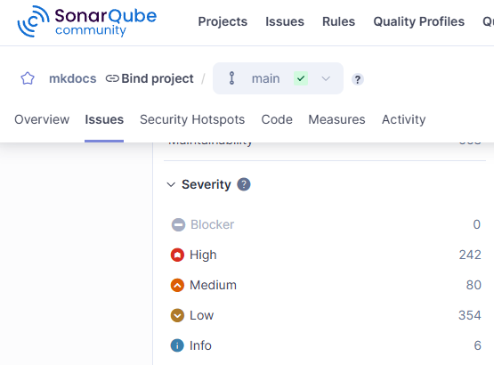
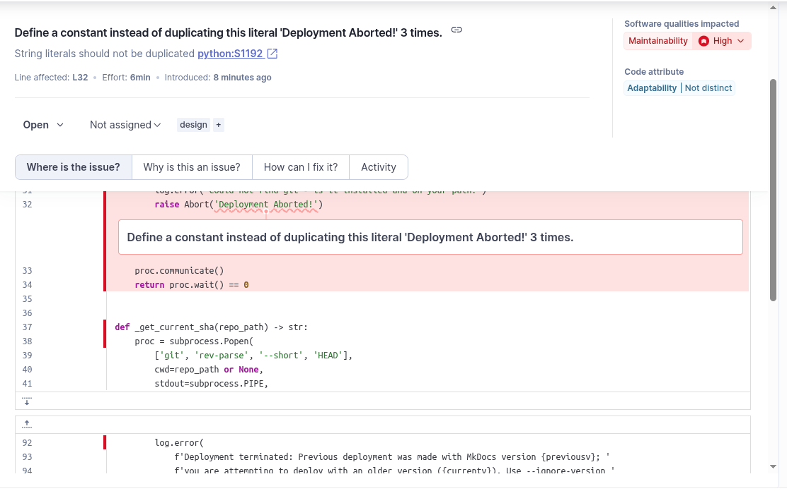
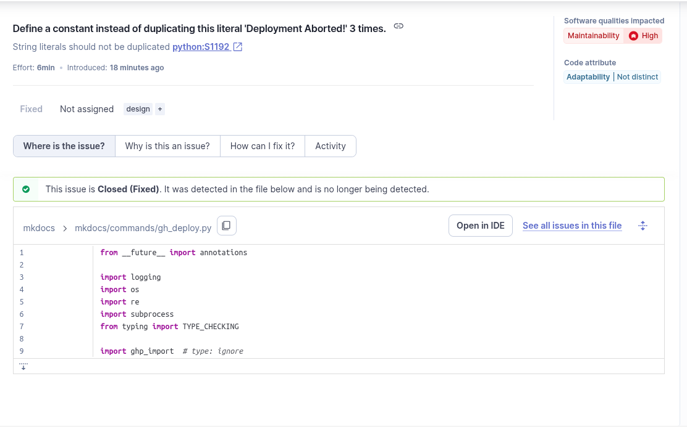
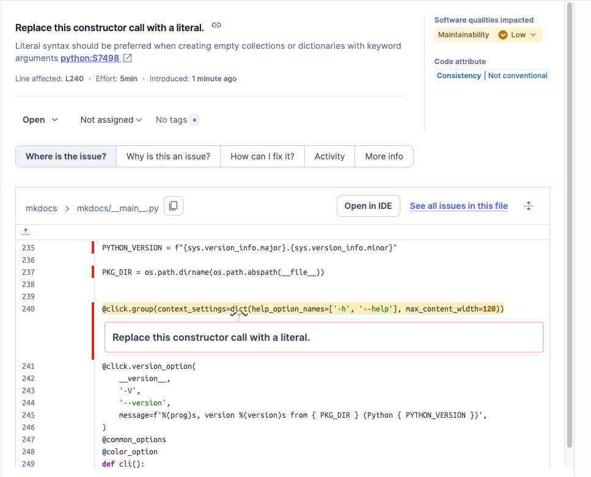
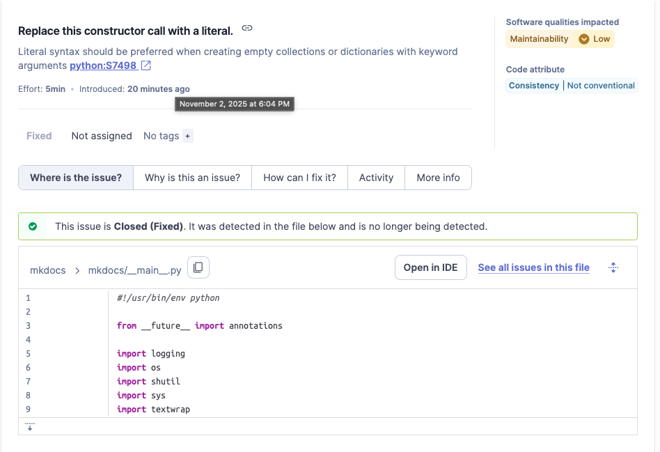
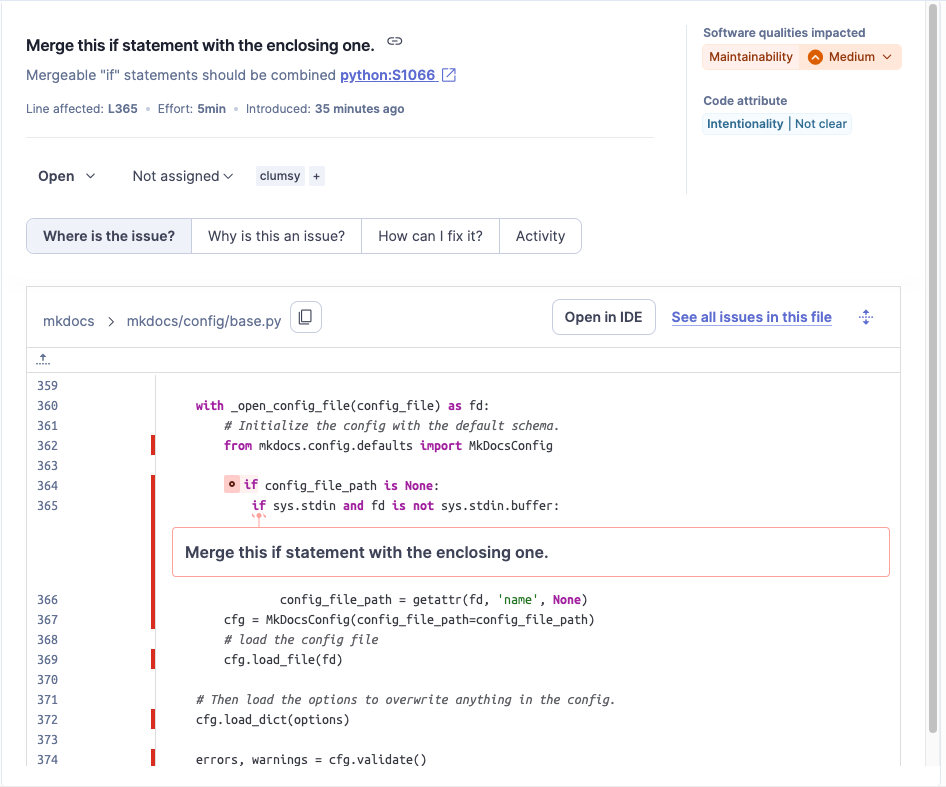
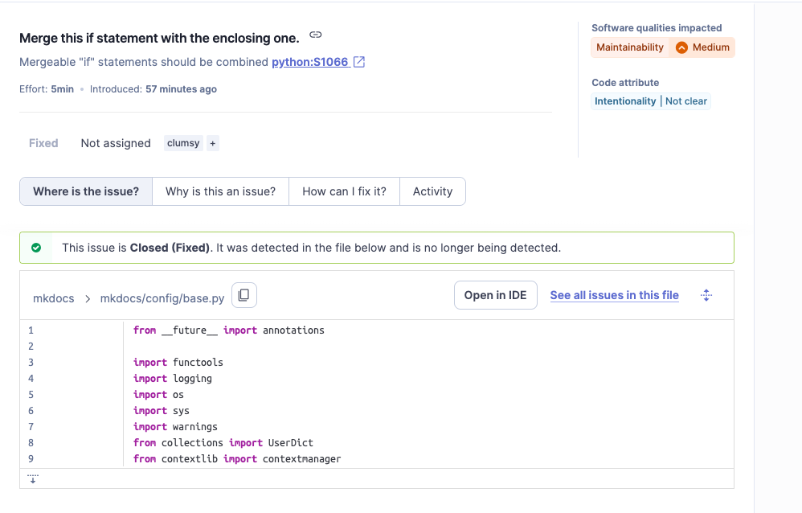

# Static Analysis & Code Smell Detection

This document reports on static analysis testing performed on the MkDocs project using SonarQube.

**Prerequisites**
Before continuing, make sure Docker is installed and running on your machine.

**Tools**
- **SonarQube Community Edition** – Static code analysis platform  
- **PostgreSQL** – Database backend for SonarQube  
- **SonarScanner** – CLI tool to analyze your project’s source code  
- **Docker** – Containerized environment for consistent setup  

**System Configuration**
This repository uses **Docker Compose** to:
- Deploy SonarQube and PostgreSQL containers  
- Automatically initialize SonarQube and generate an authentication token  
- Append the token to the `.env` file for later use by the scanner  

## 🔧 Workflow

1. **Setting up the .env file**
```bash
cp .env.example .env 
```

2. **Configuring the permission**
```bash
sudo chown -R 1000:1000 .
```

3. **Run the docker compose to configure the tools**
*quirk: If you are running this for the first time, you will need to run it twice as the first run generate the sonar token*
```bash
docker compose up -d
```

4. **View SonarQube Results**
```bash
visit http://localhost:9888 in the browser
login with your creds from .env
```


## 📊 Initial Scan Results

### Issues Overview



**Software Quality:**

- 🔒 Security: 0
- ⚙️ Reliability: 14
- 🔧 Maintainability: 669

**Severity Distribution:**

- 🚫 Blocker: 1
- 🔴 High: 242
- 🟠 Medium: 80
- 🟡 Low: 354
- ℹ️ Info: 6

### Security Hotspots



**89 Security Hotspots to Review:**

- 🔴 High Priority: Cross-Site Scripting (XSS) - 1
- 🟠 Medium Priority: Denial of Service (DoS) - 1
- 🟡 Low Priority: Encryption of Sensitive Data - 75
- Others - 12

## Fix Summary

### Fix 1 - BLOCKER: `Refactor this method to not always return the same value`



**Issue Details:**

- **Type:** Blocker - Maintainability
- **Rule:** Functions returns should not be invariant (python:S3516)
- **File:** `mkdocs/config/config_options.py`

**Problem:**
The `run_validation` method in the `DictOfItems` class was processing and validating configuration items through multiple steps (pre-validation, type checking, validation, and post-validation), but then returned the original unmodified `value` instead of the validated data stored in `fake_config.data`. This meant all the validation work was being discarded.

**Root Cause:**
The method performed validation on `fake_config` dictionary but incorrectly returned the original `value` parameter, making the function's return value invariant regardless of the validation logic.

**Fix Applied:**

```python
# Before
return value

# After
return fake_config.data
```

**Verification:**
Re-ran sonar-scanner `docker compose run --rm sonarscanner` to verify issue resolution. Blocker count reduced from 1 to 0.




### Fix 2 - Deployment Abort Error Message Duplications: `Refactor the deployment abort error to a constant`


**Issue Details:**

- **Type:** Maintainability
- **Rule:** String literals should not be duplicated (python:S1192)
- **File:** `mkdocs/commands/gh_deploy.py`

**Problem:**
When a deployment fails in various functions in `gh_deploy.py`, it should return an error message notifying the user that the deployment failed. However, the same error was hardcoded in three different functions. This can lead to issues when testing, as the developer cannot guarantee the consistency of the error or avoid possible typos, thus causing test cases to fail.

The fix is straightforward: move the error message to a constant and raise the constant instead of using a string literal.

**Root Cause:**
Three different methods throw an exception when they cannot perform deployment for various reasons. The culprit was `raise Abort(Deployment Aborted!)`.

**Fix Applied:**

```python
# Before
raise Abort(`Deployment Aborted!`)

# After
raise Abort(ABORT_DEPLOYMENT_MESSAGE)
```

**Verification:**
Re-ran the scanner `docker compose run --rm sonarscanner` to verify the fix.



### Fix 3 - Maintainability `Replace this constructor call with a literal`



**Issue Details:**
- **Type:** Maintainability
- **Rule:** Literal syntax should be preferred when creating empty collections or dictionaries with keyword arguments (python:S7498)
- **File:** `mkdocs/__main__.py`

**Problem:**
In Python, using literal syntax, like `{}` for dictionaries, is generally preferred over using constructor calls like `dict()`. The literal syntax is more concise and readable while also making the code more consistent with Python best practices. Using constructors can be less efficient and less clear which is important for maintainability and fuction of the software.

**Root Cause:**
In `__main__.py`, there was a line that created a dictionary using the `dict()` constructor. This is less pythonic than using the literal syntax `{}` for initializing dictionaries.

**Fix Applied:**

```python
# Before
@click.group(context_settings=dict(help_option_names=['-h', '--help'], max_content_width=120))
# After
@click.group(context_settings={'help_option_names': ['-h', '--help'], 'max_content_width': 120})
```

**Verification:**
Reran the scanner `docker compose run --rm sonarscanner` to verify the fix.



### Fix 4 - Maintainability `Merge this if statement with the enclosing one.`



**Issue Details:**
- **Type:** Maintainability
- **Rule:** Mergeable "if" statements should be combined (python:S1066)
- **File:** `mkdocs/config/base.py`

**Problem:**
In the `load_config()` method of `base.py`, there were nested `if` statements that could be merged into a single statement. Merging these statements improves readability and reduces unnecessary indentation, making the code cleaner and easier to understand.

**Root Cause:**
The nested `if` statements check if `config_file_path` is `None` and then check if `sys.stdin` is available and if `fd` is not `sys.stdin.buffer`. These checks can be combined into a single condition.

**Fix Applied:**

```python
# Before
if config_file_path is None:
    if sys.stdin and fd is not sys.stdin.buffer:
        # Rest of the code
# After
if config_file_path is None and sys.stdin and fd is not sys.stdin.buffer:
    # Rest of the code
```

**Verification:**
Reran the scanner `docker compose run --rm sonarscanner` to verify the fix.



## Team Contributions

 Member | Task/Contribution | Notes  
--------|------------------|--------
 AJ Barea | SonarQube setup via Docker, identified and fixed BLOCKER maintainability issue in config_options.py, created documentation with workflow and screenshots | Fixed blocker: run_validation now returns validated data (reduced MkDocs blockers from 1 to 0). Previous experience with SonarQube saved me hours!
 Connor | Fixed constructor call issue in `mkdocs/__main__.py`, fixed nested if statement in `mkdocs/config/base.py`, reread documentation and corrected errors, ran auto-formatting for code to make sure it was inline with rules set by mkdocs developers | Improved code maintainability by replacing dict() with {} literal syntax and merging if statements. Fixed numbering issue in fix summary. Used `hatch fmt` and other `style` commands defined by mkdocs developers for code formatting.
 Kemoy |Move SonarQube and other tools setup to docker-compose.yaml, setup sonar-project.properties file,write bash script to automate generate tokens, fix string literal duplication issue spotted by sonarqube, update the documentation - | Fixed string literal issue, automate the static analysis sytem
