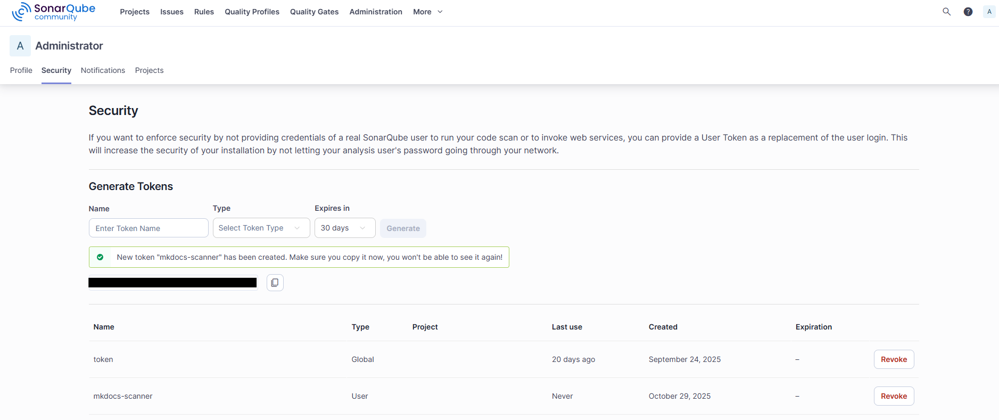

# Static Analysis & Code Smell Detection

This document reports on static analysis testing performed on the MkDocs project using SonarQube.

**Tool:** SonarQube Community Edition

## 🔧 Workflow (Windows Bash)

1.  **Run SonarQube through Docker**

    ```bash
    docker start sonarqube
    ```

2.  **Generate Security Token**

    ```text
    Generate a User token at <http://localhost:9000/account/security>
    ```

    

3.  **Execute SonarQube static analysis**

    ```bash
    sonar-scanner \
    -Dsonar.projectKey=mkdocs \
    -Dsonar.sources=mkdocs \
    -Dsonar.host.url=http://localhost:9000 \
    -Dsonar.token=SONAR_TOKEN \
    -Dsonar.python.version=3.10
    ```

## 📊 Initial Scan Results

### Issues Overview


**Software Quality:**

- 🔒 Security: 0
- ⚙️ Reliability: 14
- 🔧 Maintainability: 669

**Severity Distribution:**

- 🚫 Blocker: 1
- 🔴 High: 242
- 🟠 Medium: 80
- 🟡 Low: 354
- ℹ️ Info: 6

### Security Hotspots


**89 Security Hotspots to Review:**

- 🔴 High Priority: Cross-Site Scripting (XSS) - 1
- 🟠 Medium Priority: Denial of Service (DoS) - 1
- 🟡 Low Priority: Encryption of Sensitive Data - 75
- Others - 12

## Fix Summary

### Fix 1 - BLOCKER: `Refactor this method to not always return the same value`


**Issue Details:**

- **Type:** Blocker - Maintainability
- **Rule:** Functions returns should not be invariant (python:S3516)
- **File:** `mkdocs/config/config_options.py`

**Problem:**
The `run_validation` method in the `DictOfItems` class was processing and validating configuration items through multiple steps (pre-validation, type checking, validation, and post-validation), but then returned the original unmodified `value` instead of the validated data stored in `fake_config.data`. This meant all the validation work was being discarded.

**Root Cause:**
The method performed validation on `fake_config` dictionary but incorrectly returned the original `value` parameter, making the function's return value invariant regardless of the validation logic.

**Fix Applied:**

```python
# Before
return value

# After
return fake_config.data
```

**Verification:**
Re-ran sonar-scanner to verify issue resolution. Blocker count reduced from 1 to 0.


## Team Contributions

 Member | Task/Contribution | Notes  
--------|------------------|--------
 AJ Barea | SonarQube setup via Docker, identified and fixed BLOCKER maintainability issue in config_options.py, created documentation with workflow and screenshots | Fixed blocker: run_validation now returns validated data (reduced MkDocs blockers from 1 to 0). Previous experience with SonarQube saved me hours!
 Connor | - | -
 Kemoy | - | -
