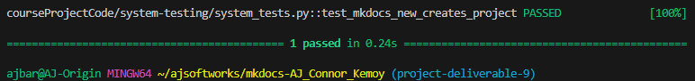

# System Testing Report

## Overview

This document highlights the system tests performed on MkDocs. System tests validate end-to-end workflows through black-box testing of the CLI interface, ensuring that user-facing functionality meets the specified functional requirements.

**Test Approach:** Black-box testing using `subprocess` (no internal MkDocs modules imported)  
**Test Framework:** pytest

---

## New Project Creation Workflow

### Test Design Summary

**Test Type:** Black-box system test  
**Test File:** `courseProjectCode/system-testing/system_tests.py::test_mkdocs_new_creates_project`

**Modules Tested:**

- CLI interface (`mkdocs new` command)
- Project scaffolding system
- Default configuration generation

**Test Approach:**

```python
# Execute via subprocess (black-box)
subprocess.run(['mkdocs', 'new', project_name], cwd=temp_dir)

# Verify project structure
assert os.path.exists(project_path)
assert os.path.isfile('mkdocs.yml')
assert os.path.isdir('docs/')
assert os.path.isfile('docs/index.md')
```

### Test Data Preparation

- Create temporary directory for test execution
- Execute `mkdocs new test_project` with subprocess run
- Capture command output and exit code
- Verify system file and directory changes

### Test Case Details

 Workflow | Setup | Test Steps | Expected Results | Status
----------|-------|------------|------------------|--------
 New Project Creation | Temporary directory created | 1. Run `mkdocs new test_project`<br>2. Verify exit code = 0<br>3. Check project directory exists<br>4. Verify mkdocs.yml created<br>5. Verify docs/ directory created<br>6. Verify docs/index.md created<br>7. Check file contents | - Project directory created<br>- mkdocs.yml contains `site_name: My Docs`<br>- docs/ directory exists<br>- docs/index.md contains welcome content<br>- Command exits successfully | Passed

### Execution Results

```bash
# Test execution command
pytest courseProjectCode/system-testing/system_tests.py -v
```



**Observations:**

The `mkdocs new` command created a complete project structure through the CLI interface. The test verifies:

- Command executes without errors (exit code 0)
- Project directory is created with the correct name
- Configuration file (`mkdocs.yml`) is generated with default `site_name: My Docs`
- Documentation directory (`docs/`) is created
- Default homepage (`docs/index.md`) is created including its welcome content and command reference
- All files contain expected default content

This black-box test validates the complete end-to-end workflow of the new project creation workflow without accessing internal implementation details.

---

## Team Contributions

 Member | Task/Contribution | Test Cases Implemented
--------|------------------|----------------------
 AJ Barea | System testing infrastructure setup, created test file structure, implemented new project creation workflow system test using a black-box subprocess approach, created docs | New Project Creation Workflow
 Connor | - | -
 Kemoy | - | -

---

## References

- **Test File:** `courseProjectCode/system-testing/system_tests.py`
- **Setup Guide:** `courseProjectDocs/system-testing/README.md`
- **Black-Box Testing:** Tests through CLI interface only, no internal imports
