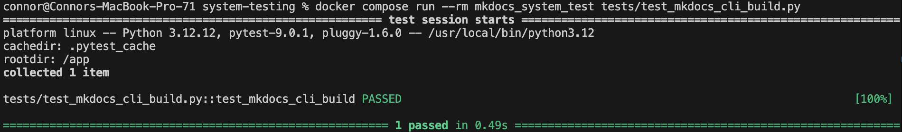

# System Testing Report

## Overview

This document highlights the system tests performed on MkDocs. System tests validate end-to-end workflows through black-box testing of the CLI interface, ensuring that user-facing functionality meets the specified functional requirements.

We utilize docker system to create a container which installed mkdocs and provides an isolate environment
for testing. 

**Test Approach:** Black-box testing using `subprocess` and requests (no internal MkDocs modules imported)  
**Test Framework:** pytest
**Test Environment**: Docker - Create a container with mkdocs installed in the container

---
## New Project Creation Workflow

### Test Design Summary

**Test Type:** Black-box system test  
**Test File:** `courseProjectCode/system-testing/test_mkdocs_cli_new.py`
**Execute The Test**:`docker-compose run --rm mkdocs_system_test tests/test_mkdocs_cli_new.py`

**Modules Tested:**

- CLI interface (`mkdocs new` command)
- Project scaffolding system
- Default configuration generation

**Test Approach:**

```python
# Execute via subprocess (black-box)
subprocess.run(['mkdocs', 'new', project_name], cwd=temp_dir)

# Verify project structure
assert os.path.exists(project_path)
assert os.path.isfile('mkdocs.yml')
assert os.path.isdir('docs/')
assert os.path.isfile('docs/index.md')
```

### Test Data Preparation

- Create temporary directory for test execution
- Execute `mkdocs new test_project` with subprocess run
- Capture command output and exit code
- Verify system file and directory changes

### Test Case Details

 Workflow | Setup | Test Steps | Expected Results | Status
----------|-------|------------|------------------|--------
 New Project Creation | Temporary directory created | 1. Run `mkdocs new test_project`<br>2. Verify exit code = 0<br>3. Check project directory exists<br>4. Verify mkdocs.yml created<br>5. Verify docs/ directory created<br>6. Verify docs/index.md created<br>7. Check file contents | - Project directory created<br>- mkdocs.yml contains `site_name: My Docs`<br>- docs/ directory exists<br>- docs/index.md contains welcome content<br>- Command exits successfully | Passed

### Execution Results

```bash
# Test execution command
docker-compose run --rm mkdocs_system_test tests/test_mkdocs_cli_new.py
```


**Observations:**

The `mkdocs new` command created a complete project structure through the CLI interface. The test verifies:

- Command executes without errors (exit code 0)
- Project directory is created with the correct name
- Configuration file (`mkdocs.yml`) is generated with default `site_name: My Docs`
- Documentation directory (`docs/`) is created
- Default homepage (`docs/index.md`) is created including its welcome content and command reference
- All files contain expected default content

This black-box test validates the complete end-to-end workflow of the new project creation workflow without accessing internal implementation details.

---
---
## Serve Workflow

### Test Design Summary

**Test Type:** Black-box system test  
**Test File:** `courseProjectCode/system-testing/test_mkdocs_cli_serve.py`
**Execute The Test**:`docker-compose run --rm mkdocs_system_test tests/test_mkdocs_cli_serve.py`

**Modules Tested:**

- CLI interface (`mkdocs serve` command)
- Spin up a web server and show the site contents from `mkdocs/docs`
- Byproduct command - `mkdoc new` to build a default new project with default configurations 

**Test Approach:**

```python
# Execute via subprocess (black-box)
process = subprocess.Popen(
    ["mkdocs", "serve", "-a", "0.0.0.0:8000"],
    cwd=mkdocs_dir,
    stdout=subprocess.PIPE,
    stderr=subprocess.PIPE,
)

# Verify that we get 200 response and the default web page
assert response.status_code == 200, "Failed to response with status 200"
assert "Welcome to MkDocs" in response.text, "Homepage content does not contain Welcome to MkDocs"
```

### Test Data Preparation

- Create temporary directory for test execution
- Run `mkdocs new` to create a default project with the default configuration
- Execute `mkdocs serve -a 0.0.0.0:8000` to bind it to listen on all interface at port 8000
- Wait for the server to start. We will attempt up to 5 retries if need
- Make a HTTP resquest and capture the response
- Verify the response and content on the webpage is what is expected

### Test Case Details

 Workflow | Setup | Test Steps | Expected Results | Status
----------|-------|------------|------------------|--------
 Serve | Temporary directory created | 1. Run `mkdocs new mkdocs` to create a default project<br>2. Run `mkdocs serve -a 0.0.0.0:8000` to start the web server<br>3. Wait for the web server to start up. Max 5 retries check<br>4. Make HTTP requests to `localhost:8000`<br>5. Verify the response is 200<br>6. Verify that `Welcome to MkDocs` is in the index.html content<br>7. Send kill signal to terminate the web server<br>-  Command exits successfully | Passed


### Execution Results

```bash
# Test execution command
docker-compose run --rm mkdocs_system_test tests/test_mkdocs_cli_serve.py
```


**Observations:**

The `mkdocs new` command created a complete project structure through the CLI interface.
The `mkdocs serve -a 0.0.0.0:8000` start a web server and serves the contents default contents that were generated using `mkdocs new`. The tests verifies:

- The server successfully start
- The `index.html` responses with `200` status
- The `index.html` contains `Welcome to MkDocs` in its html content


This black-box test validates the complete end-to-end workflow of the serve workflow without accessing internal implementation details.
---
---
## Build Workflow

### Test Design Summary

**Test Type:** Black-box system test

**Test File:** `courseProjectCode/system-testing/test_mkdocs_cli_build.py`

**Execute The Test**:`docker-compose run --rm mkdocs_system_test tests/test_mkdocs_cli_build.py`

**Modules Tested:**
- CLI interface (`mkdocs build` command)
- Site building system
- Config file parsing

**Test Approach:**
- Execute `mkdocs build` via subprocess in a temporary directory with a simple project containing a yml config file and two simple pages (index.md and about.md), which will be the home and about page respectively.
- Verify that the command exits with code 0, meaning it was successful
- Verify that the html files are properly generated in the proper folder under the temporary directory

### Test Data Preparation
- Create a temporary directory to hold the files for the test
- Create a `mkdocs.yml` config file with site name and nav structure
- Create a `docs/` directory with `index.md` and `about.md` for the home and about page respectively
- Execute `mkdocs build` command via subprocess in the temporary directory

### Test Case Details

 Workflow | Setup | Test Steps | Expected Results | Status
----------|-------|------------|------------------|--------
 Build | Temporary directory with mkdocs.yml and docs/ created | 1. Create a temporary directory and the config file at the root of the directory<br>2. Create a docs directory with an index.md and an about.md with a header and a single sentence<br>3. Run `mkdocs build` in the temporary directory<br>4. Verify exit code = 0<br>5. Verify that the `site/` directory is created<br>6. Verify that `index.html` and `about/index.html` are created in the `site/` directory<br>7. Verify that the contents of the generated html files match expected content | - Command exits successfully<br>- `site/` directory created<br>- `index.html` and `about.html` created<br>- Generated html files contain expected content | Passed

### Execution Results
```bash
# Test execution command
docker-compose run --rm mkdocs_system_test tests/test_mkdocs_cli_build.py
```



**Observations:**
The `mkdocs build` command generates the static site files from the provided markdown files and configuration file. The test verifies:
- Command executes without errors (exit code 0)
- `site/` directory is created
- `index.html` and `about/index.html` are created in the `site/`
- Generated html files contain expected content based on the markdown files

BeautifulSoup was used to parse the generated HTML files since mkdocs adds extra HTML stuff around the converted markdown content, making it harder to do string matching. BeautifulSoup allows us to easily extract the text content from the expected HTML elements for verification. Even thought the existing mkdocs integration tests found in `mkdocs/tests/integration.py` already cover some of the build functionality, they do not automatically verify the results. This black-box system test validates the entire build workflow through the CLI interface rather than just generating the files and leaving it up to a human to verify the results.

## Team Contributions

 Member | Task/Contribution | Test Cases Implemented
--------|------------------|----------------------
 AJ Barea | System testing infrastructure setup, created test file structure, implemented new project creation workflow system test using a black-box subprocess approach, created docs | New Project Creation Workflow
 Connor | Created a simple system test for the build workflow and updated project documentation accordingly | Build workflow. Verified with beautifulsoup4 that the generated html files contain the expected content from the markdown source files.
 Kemoy | Configure Dockerfile and compose.yaml so that the tests can be run in a container with mkdocs installed on the system, write the black box test for the interaction with `mkdocs serve` cli, update the documentation | Dockerize the mkdocs installation and black box testing environment, follow along documentations

---

